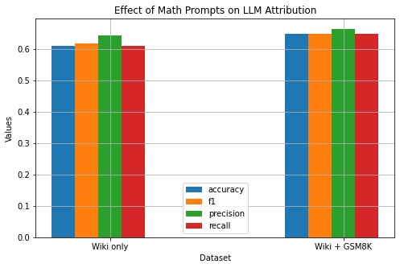
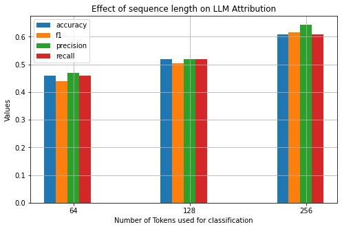
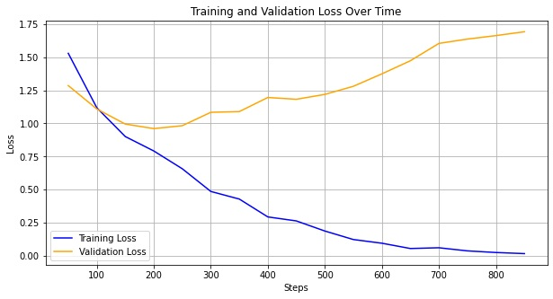
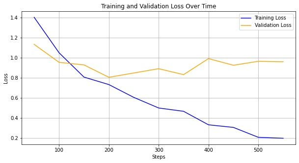
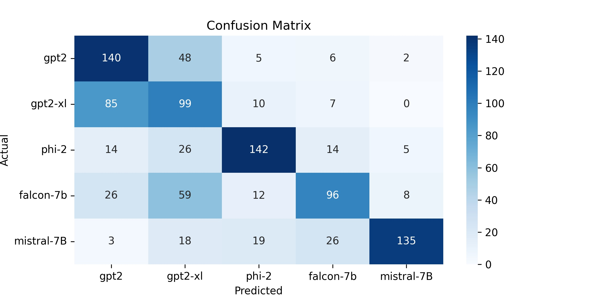
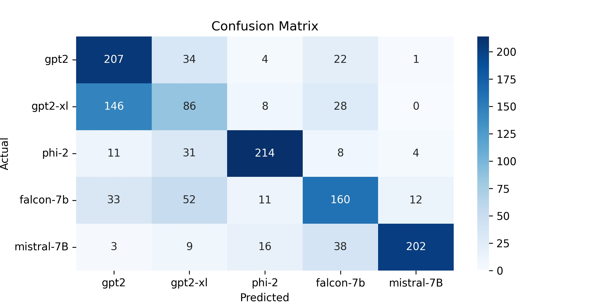
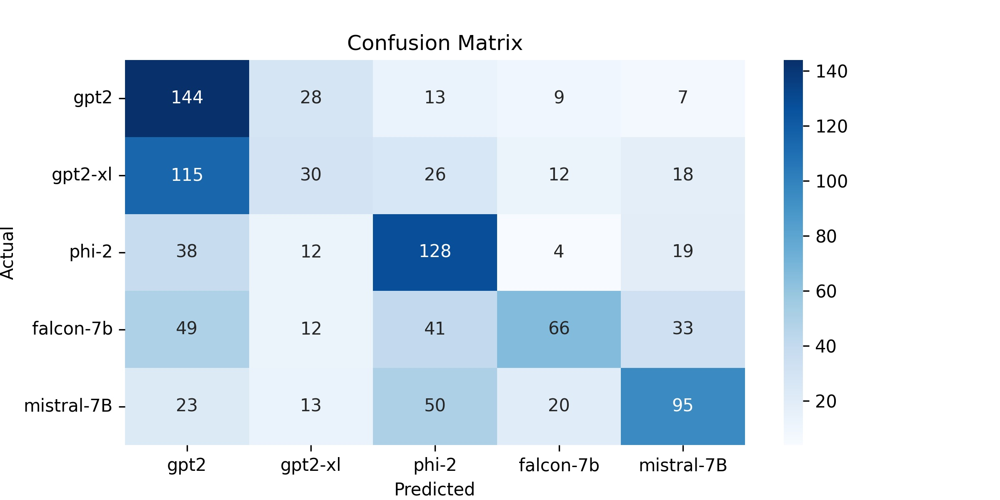
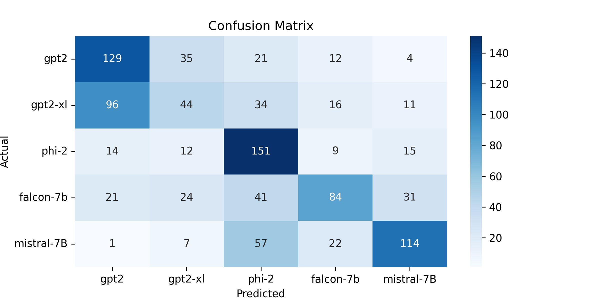

<h1 align="center">Machine-Generated Text Attribution</h1>

👉 Mid-Term Project for CSE 584 - Machine Learning course for PSU Fall 24.

👉 Read the full report [here](https://github.com/sinjoysaha/cse584-ml-psu-f24/blob/main/midterm-project/CSE584_ML_MidTermProject_paper.pdf).

## 🔍Table of Contents

* [Abstract](#abstract)
* [Dataset](#dataset)
* [Steps](#steps)
* [Results](#results)
* [Contact](#contact)

## Abstract

Advancements in text generation technology have made it easy for malicious users to generate
large volumes of human-like content without technical expertise, raising concerns about misuse,
such as fake news and phishing. Detecting AI-generated text is crucial for responsible use and
content moderation, leading to increased research in Machine-Generated Text (MGT) Detection. A
more specific challenge is attributing MGT to the specific model that generated it, known as MGT
Attribution. In this paper, we review existing datasets and methods for model attribution and introduce
a new dataset to train a classifier for identifying the source LLM behind a given text. We study the
effects of different datasets and varying lengths of generated texts on LLM attribution. We empirically
show that it is easier for a classifier model to attribute the input text to an LLM when the LLMs
have been prompted with technical questions than being prompted with only simple text completion
tasks. We also show that it is easier to attribute longer texts than shorter texts. Finally, we gain some
preliminary insights on the effects of parameter size and pre-training dataset on text generation.

**Keywords**: `LLM` · `machine-generated text attribution` · `classification` · `BERT`

## Dataset

**Table 1:** Summary of decoder-only text generation models used to create the dataset.

| Model                    | Institute  | # Parameters |
| ------------------------ | ---------- | ------------ |
| GPT-2-small              | OpenAI     | 117M         |
| GPT-2-XL                 | OpenAI     | 1.5B         |
| Phi-2                    | Microsoft  | 2.7B         |
| Falcon-7b                | TII        | 7B           |
| Mistral-7B-Instruct-v0.2 | Mistral AI | 7B           |

**Table 2:** Split for the two datasets containing text generated by five language models.

| Dataset       | Training | Validation | Test |
| ------------- | -------- | ---------- | ---- |
| **Wikipedia** | 5445     | 995        | 1005 |
| **GSM8K**     | 1680     | 425        | 335  |
| **Total**     | 7125     | 1420       | 1340 |

## Steps

The llm-atribution.ipynb file contains the entire code to generate the initial prompts, use the five different models to generate the outputs and finally use BERT sequence classifier model for the attribution task.

The parameters for the different experiments are as follows:

### Collate $x_i$ from Wiki Dataset & GSM8K
- run code from notebook
- output files - wiki_train.csv, wiki_val.csv, wiki_test.csv, gsm8k_train.csv, gsm8k_val.csv, gsm8k_test.csv

### Generate model outputs 
- MODEL - "gpt2", "gpt2-xl", "microsoft/phi-2", "tiiuae/falcon-7b", "mistralai/Mistral-7B-Instruct-v0.2"
- output files - 2x3x5 = 30 individual files in the format DATASET_SPLIT_MODEL.csv

### BERT Sequence Classification
- MAX_LENGTH - 64, 128, 256
- ds - "wiki", "all"
- epochs - 5, 10
- output files - each run is saved to an individual folder under ./results folder in the format DATASET_SEQLENGTH_EPOCHS
- for each run, training state, checkpoints and best model along with results (val, test data and plots) are saved to respective folders.

## Results

**Figure 1:** Training and validation loss over training steps for BERT sequence classifier on Wikipedia dataset.

**Figure 2:** Training and validation loss over training steps for BERT sequence classifier on combined Wikipedia and GSM8K dataset.

### Effect of Mathematical Prompts

**Figure 3:** Accuracy, F1-score (macro), precision and recall for only Wikipedia and both Wikipedia and GSM8K.

 
 

**Figure 4:** Confusion matrices for only Wikipedia and both Wikipedia and GSM8K.

### Effect of length of generated text

**Figure 5:** Accuracy, F1-score (macro), precision and recall for varying generated text sequence lengths (64, 128 and 256 tokens) used for classifier model.

 
 

**Figure 6:** Confusion matrices for varying generated text sequence lengths (64, 128 and 256 tokens) used for the classifier.

## Contact

Sinjoy Saha
  * [LinkedIn](https://linkedin.com/in/sinjoysaha)
  * [Twitter](https://twitter.com/SinjoySaha)
